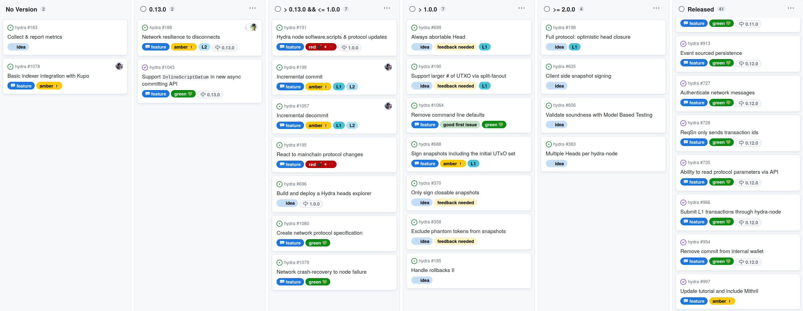

This report summarizes the work on Hydra since August 2023. It serves as
preparation for the monthly review meeting (see [slides][slides] and
[recording][recording]), where the team updates project stakeholders on recent
developments to gather their feedback on proposed plans.

## Roadmap

This month, the
[roadmap](https://github.com/orgs/input-output-hk/projects/21/views/7) has not
changed much as the team mostly clarified upcoming features.

 <small>
The latest roadmap with features and ideas
</small>

#### Notable updates

* Added and completed [support for inline datums in commit API #1043](https://github.com/input-output-hk/hydra/issues/1043), which was reported by a user.

* Current work on [network resilience #188](https://github.com/input-output-hk/hydra/issues/188) yielded two new / follow-up items [#1079](https://github.com/input-output-hk/hydra/issues/1079) and [#1080](https://github.com/input-output-hk/hydra/issues/1080). This topic easily "scope creeps" and we had narrowed down the direct goal to improve the situation incrementally.

* When detailing the design of incremental de-/commits, the feature was also split in two. Each of the features would have a different impact on the user experience and relates to other ideas:

  - [Incremental commit #199](https://github.com/input-output-hk/hydra/issues/199) is a bit more complicated, but paves the way for directly open heads and could make [Always abortable head #699](https://github.com/input-output-hk/hydra/issues/699) redundant.

  - [Incremental decommit #1057](https://github.com/input-output-hk/hydra/issues/1057) is fairly straight-forward and can be evolved into "partial fanouts", which solves similar problems as the [split-fanout #190](https://github.com/input-output-hk/hydra/issues/190) and [only signing closable snapshots #370](https://github.com/input-output-hk/hydra/issues/370) would address. Also, the [optimistic head closure #198](https://github.com/input-output-hk/hydra/issues/198) feature is very related to this item.

* Added a new feature to improve user journey of running the `hydra-node` by [removing the command line defaults #1064](https://github.com/input-output-hk/hydra/issues/1064). This came out of prior [idea discussion #454](https://github.com/input-output-hk/hydra/discussions/454) which highlights the life-cycle of ideas and features on the Hydra project.

## Cardano Scaling workshop in Nantes, France

TODO arnaud

### Aiken validator experiment

As part of thw workshop, we explored how hard it would be to implement one of
the Hydra validators in `aiken`. After roughly 2 hours of work we had a
`hydra-node` running, tests passing and benchmarks of verifying one step in the
Hydra protocol using aiken.

The `hydra-node` just uses the UPLC binary and its hash to construct
transactions, we could rely on the same interface, with the difference that the
script binary gets produced by `aiken`. Aiken does produce a socalled blueprint
`plutus.json` containing the contract. We staged that file into git and embedded
it into a Haskell interface to be able to reference the compiled script as
`SerialisedScript` from `hydra-node`.

Next, we ported the simplest contract we have, namely the
[Commit](https://github.com/input-output-hk/hydra/blob/ec6c7a2ab651462228475d0b34264e9a182c22bb/hydra-plutus/src/Hydra/Contract/Commit.hs)
validator, [to
Aiken](https://github.com/input-output-hk/hydra/blob/4ec572511fc13a526b85efce3aac556ae5bd007c/hydra-plutus/validators/commit.ak).
This was fairly straight-forward and we test were passing after some fiddling
with internal representations of data strctures (`plutus-tx` is encoding triples
as `Constr` data on-chain).

The results? A significant reduction in script size, cpu and memory usage on
`collect` and `abort` transactions - or in different words, [doubling the
supported](https://github.com/input-output-hk/hydra/pull/1072#issuecomment-1717644108)
number of parties in a Head. 🎉

### Shallow cardano-node experiment

TODO arnaud

## Hydra development

[Issues and pull requests closed since the last
report](https://github.com/input-output-hk/hydra/issues?q=is%3Aclosed+sort%3Aupdated-desc+closed%3A2023-08-29..2023-09-29)

This month, the team worked on the following:

#### Network resilience to disconnects [#188](https://github.com/input-output-hk/hydra/issues/188)

TODO pascal, franco or sasha

- State of exploration / problem statement
- Current strategy / next steps
- Refined the scope -> split into multiple features (include links)

#### Incremental commits and decommits [#199](https://github.com/input-output-hk/hydra/issues/199)

In the beginning of this month, some progress on incremental commits and
decommits was made. An early
[experiment](https://twitter.com/ch1bo_/status/1696067253089743289) about the
off-chain / node logic showed that we can re-use the `/commit` validator and
motivated design work on the feature items.

As mentioned above, the protocol extension was split into two items [Incremental
commits #199](https://github.com/input-output-hk/hydra/issues/199) and
[Incremental decommits
#1057](https://github.com/input-output-hk/hydra/issues/1057). Both items contain
high-level description, interaction outline and a first design of the on-chain
validators which is currently getting discussed by the Hydra contributors and
researchers.

Especially the incremental commit is not trivial as the interaction between
layer 1 and layer 2 is quite intricate. Observing a deposit on the Cardano
mainchain may not be seen by all parties at the same time and this should not
lock up the layer 2 process of transactions, while premature usage of committed
funds is to be avoided. On the other hand, each step in the protocol needs to be
secure in presence of an adversary and unlocking of committed funds must always
be possible.

Once this validator design is clear, we can get started implementing one or both
of the features to enable more flexible usage of the Hydra head protocol.

#### Refactored chain state

TODO franco

- why and how did we do it
- backward compatible change
- what is the benefit

## Community

#### Open source contributions

TODO sebastian

- Hydra: Lightning network-style payments use case write-up by @k-solutions
- Aiken: Started an emacs aiken-mode by @ch1bo (in course of our experiments)
- Hydra: Small fix in the docs (from workshop) by @caike

#### Current scaling use cases we track

TODO: nebojsa? include this? or only Hypix (as the new thing)?

- Hypix - productized hydraw
- Book.io - scalable minting and distribution of tokenized books
- Midnight - dust airdrop and side-chain operatio
- SingularityNet - pay-per-use API / Cardano port of an existing Ethereum solution
- SundaeLabs - scaling their DEX using gummiworm / hydra ledger-only as validators
- Emurgo/Obsidian - general interest in creating a payment channel network

## Conclusion

The monthly review meeting for August 2023 was held on 2023-09-20 via Google
Meet with these [slides][slides] and the [recording][recording], 'broadcasting live from warm and sunny Colorado'!

TODO sebastian

* Workshop shows again how much a motivated group can achieve in a small amount of time
* Just sitting down and work together on something
* Scratching our own itch - contributing back
* Need to prototype things again and explore synergies actively by experimenting together
* Catalyst fund10 results, more community contributions incoming again

[slides]: https://docs.google.com/presentation/d/1YAWR4pz1gG2dwtGvm5KOAHtrjRcchPLUKhDA16u10ps
[recording]: https://drive.google.com/file/d/1X8QnmG9gddR-t2V6F2oE7bYCYAEs2RPe/view
