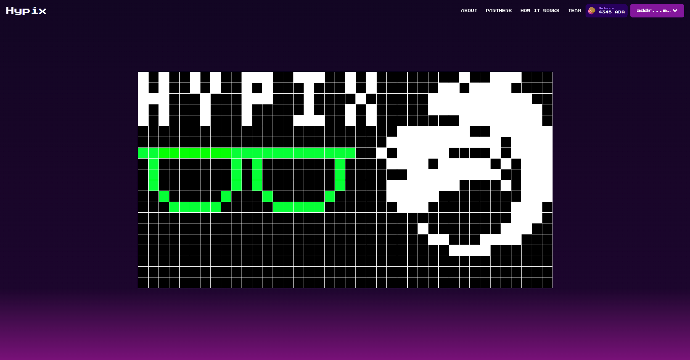
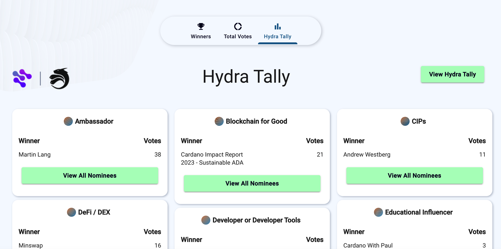

This report summarizes the work on Hydra since September 2023. It serves as
preparation for the monthly review meeting (see [slides][slides] and
[recording][recording]), where the team updates project stakeholders on recent
developments to gather their feedback on proposed plans.

## Roadmap

This month, the team released version 0.13.0, and the project
[roadmap](https://github.com/orgs/input-output-hk/projects/21/views/7) has been
updated with the next planned version 0.14.0:

 <small>
The latest roadmap with features and ideas
</small>

#### Release 0.13.0

- Security fixes to Hydra on-chain scripts; all of which are only exploitable by other Head participants (not any attacker)

- Add support for (externally) committing inline datums

- Improved stability by querying the `cardano-node` at the tip

- Improved state persistence

- See [full release notes](https://github.com/input-output-hk/hydra/releases/tag/0.13.0) and a list of [delivered features](https://github.com/input-output-hk/hydra/milestone/13?closed=1)

#### Notable updates

- Moved [network resilience
  #188](https://github.com/input-output-hk/hydra/issues/188) out of 0.13.0 to
  allow for a quick release of the security fixes. This feature has been split
  in two, is completed now, and will soon be released in 0.14.0.

- New user submitted feature idea about supporting extended keys [#1141](https://github.com/input-output-hk/hydra/issues/1141) - at first this was
  urgent, but now not anymore; needs clarification.

- Not really part of hydra version 0.14.0, but also completed is the [hydra
  support in kupo #1078](https://github.com/input-output-hk/hydra/issues/1078)
  which can already be used with kupo version
  [2.7.0](https://github.com/CardanoSolutions/kupo/releases/tag/v2.7)

- New [Hydra Poll dApp](https://github.com/input-output-hk/hydra/issues/1110)
  feature, which is an example to be demonstrated at the Cardano summit 2023.

- Realized [stateless chain observation
  #1096](https://github.com/input-output-hk/hydra/issues/1096) as a dedicated
  feature, which will add a `hydra-chain-observer` tool and simplify upcoming
  feature implementation related to L1 transactions.

- Created a feature idea item to [migrate all validators to aiken
  #1092](https://github.com/input-output-hk/hydra/issues/1092). This was moved
  to > 1.0.0 though, as it would require a complete re-audit of the scripts and
  there is no pressing reason for the performance improvements at this stage.

## Hydra development

[Issues and pull requests closed since the last
report](https://github.com/input-output-hk/hydra/issues?q=is%3Aclosed+sort%3Aupdated-desc+closed%3A2023-09-30..2023-10-31)

This month, the team worked on the following:

#### Network resilience to node crash

The previous month we worked on making the Hydra network resilient to
transient network connectivity failure (see
[#188](https://github.com/input-output-hk/hydra/issues/188)), but this
was only part of the story of improving the overall stability and
reliability of the network. By completing
[#1079](https://github.com/input-output-hk/hydra/issues/1079) we also
made the network resilient to arbitrary node failures, which is a much
more likely event to happen should the network runs for a significant
amount of time.

Hydra nodes now persist the network messages they _send_ to peers and
together with the already present acknowledgment mechanism, this means
a node recovering from a crash can resend messages which were not
received by their peers.

#### Hydra Poll dApp

As the Hydra team seeks to apply more the principles of
[dogfooding](https://en.wikipedia.org/wiki/Eating_your_own_dog_food),
we wanted to upgrade our basic Hydraw application to something more
interactive. We therefore built a [poll
dApp](https://github.com/input-output-hk/hydra/issues/1110) with the
goal of demonstrating how one can build an application living entirely
in the front-end that can interact directly with a hydra-node, using
its websockets-based API. This application was also showcased at the
[Cardano Summit 2023](https://summit.cardano.org/) where the Hydra
team delivered a masterclass.

#### Upgrade to GHC 9.6 & Brick 1.10

This month we were able to update our compiler toolchain from GHC 9.2.8 to
9.6.3. This also required us to upgrade the hydra-tui from brick 0.73 to 1.10
to stay compatible with the new version of the mtl.

With the update to brick came a complete rewrite of the hydra-tui which
greatly simplifies the application logic, using brick's new elm architecture
style combined with microlens-mtl.

## Community Update

This month, the monthly review meeting was almost completely covered by
demonstrations from the various teams working on and with Hydra. Don't miss out
on the demonstrations of the various community contributions and make sure to
also view the [recording][].

### Hypix

Hypix is a continuation of the "hydraw" demonstration the team used throughout
development. The project is spear-headed by Trym Bruset and will integrate CIP68
NFTs with instant transaction processing in a Hydra head to realize
collaboratively created art pieces. The project is progressing great with an
open beta available soon.

 <small>
The Hypix user interface
</small>

### Kupo x Hydra

Indexers of chain data, like [kupo](https://github.com/CardanoSolutions/kupo),
are useful to enable lightweight decentralized applications like Hypix. As the
application state of Hypix, for example, is not only on the Cardano layer 1, but
in the Hydra head, kupo was enhanced to run "in front of" a `hydra-node` and
provide the same API for UTxO indexed from a Hydra head. This was a [joint
effort](https://github.com/CardanoSolutions/kupo/pull/117) between
[@KtorZ](https://github.com/KtorZ), [@v0d1ch](https://github.com/v0d1ch) and
[@ch1bo](https://github.com/ch1bo) and has been [released in version 2.7 of
kupo](https://github.com/CardanoSolutions/kupo/releases/tag/v2.7).

 <small>
Kupo indexing a Hydra head
</small>

### Offline-mode Hydra node

[Ledger-only
Mode](https://projectcatalyst.io/funds/10/f10-development-and-infrastructure/sundae-labs-hydra-ledger-only-mode)
for Hydra was one of the Catalyst Fund10 projects who got funded and
work is underway to make it an integral part of Hydra software
components. A [new
ADR](https://hydra.family/head-protocol/unstable/adr/28.%20Offline%20mode)
has been proposed which details the rationale behind this new feature
and an overview of what it brings and what impacts it will have on the
hydra-node.

Moreover, implementation is
[underway](https://github.com/input-output-hk/hydra/pull/1118) and
should be part of the next release. This will enable running a single
hydra-node as a kind of "ledger-as-a-service", priming it with some
UTxO and allowing clients to submit and validate transactions without
any relationship to Layer 1.

### Voting on Hydra

The
[Hydra-for-voting](https://github.com/cardano-foundation/hydra-voting-poc)
project has been started earlier this year as a proof-of-concept to
explore how a Hydra Head could help improve the voting or rather
tallying process for Catalyst and other large-scale on-chain
decision-making process. It's been on pause for a few months due to
other priorities but it's been revived recently and put to use to
tally votes for the Cardano Summit's awards recipients.

This development effort lead to a couple new features and fixes:
* The ability to [submit
  transaction](https://github.com/input-output-hk/hydra/issues/1111)
  for L1 using "standard" CBOR-hex format
* Upgrade to the checked-in [protocol
  parameters](https://github.com/input-output-hk/hydra/issues/1117)
  used by demo network which were out of sync with the internal ledger
  version
* Discussion on the usage of [Extended payment
  keys](https://github.com/input-output-hk/hydra/issues/1141) in
  relationship with Hydra Head protocol

 <small>
Hydra Tallying UI
</small>

### zkSNARKs on Hydra

The team started discussing with another Catalyst Fund10 project that
got funded, experimenting with a [zero-knowledge proof
system](https://projectcatalyst.io/funds/10/f10-development-and-infrastructure/a-zero-knowledge-proof-framework-for-cardano-based-on-hydra-and-zk-snarks)
for Cardano implemented within a Hydra Head. There's not much to show
yet, as the project is just at its onset, but the team is eager to
start development on this exciting tool.

## Conclusion

The monthly review meeting for October 2023 was held on 2023-10-30 via Google
Meet with these [slides][slides] and the [recording][recording].

As mentioned above, the meeting was about 45 minutes of demonstrations - which
clearly shows that we are in the wake of Catalyst fund 10 where several project
proposals involving Hydra and Mithril got funded and at the same time everyone
is preparing for the Cardano Summit 2023.

With this many community contributions and projects moving forward, there was
not much time to discuss the Hydra roadmap or go into details about Mithril
project status. This is great!

Besides, the project roadmaps seem to be well aligned where our next features
in-line are most anticipated (incremental de-/commits) and adoption of Mithril
is showing a healthy level with clear next steps and features ahead.

It is getting increasingly hard to keep track of all the new developments around
Hydra. However, that is also often not needed and the Cardano builders just set
off and [build
things](https://twitter.com/AltiMario/status/1711738372320825827?s=20) using
Hydra these days.

November will start with the Cardano Summit, likely yielding even more feedback
and feature ideas from users, before we're looking at a few good weeks of
feature development before the usual Christmas and New-Year breaks across teams.

[slides]: https://docs.google.com/presentation/d/1pJMRp0YsszJenUvDmknm3wq9yyUE1CDRSYijjILrkHo
[recording]: https://drive.google.com/file/d/1U4yZhliGykxF3BddAAXb4RD417UvsQWB
