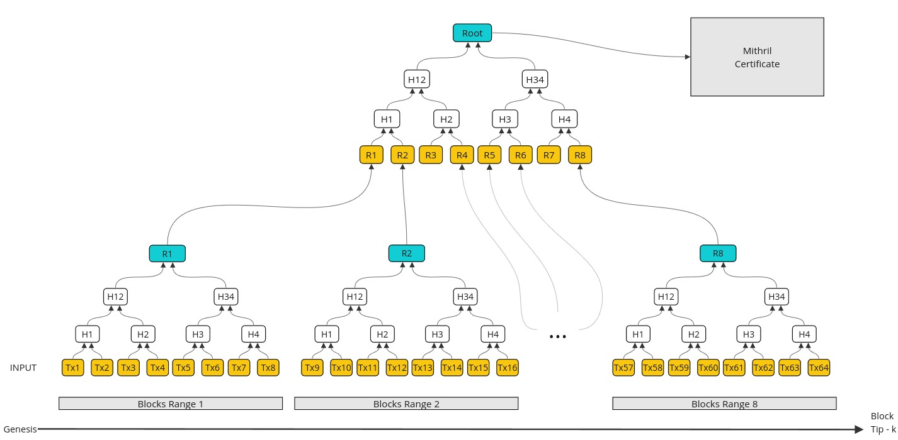
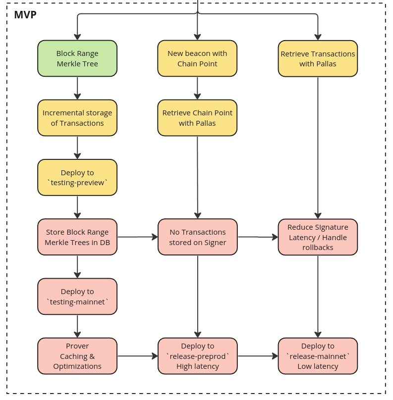
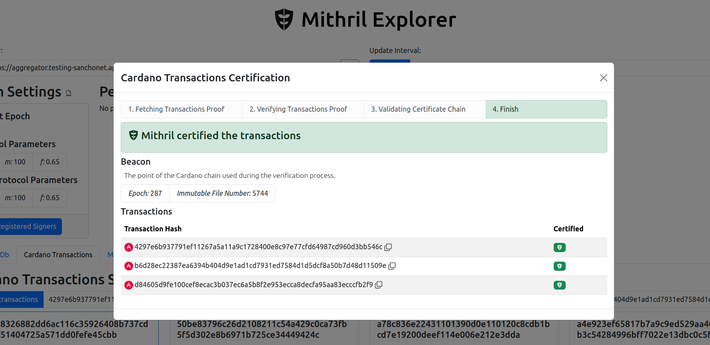

This is a monthly report of progress on 🐲 Hydra and 🛡 Mithril projects since
February 2024. These reports recently moved to
https://cardano-scaling.org/monthly (more details [here](./2024-02)).

This document serves as preparation and written summary of the monthly
stakeholder review meeting, which is announced on our discord channels and held
on Gooble Meet. This month the meeting was on 2024-03-27, using these
[slides][slides] and [this is the recording][recording].

## Mithril

[Issues and pull requests closed in
March](https://github.com/input-output-hk/mithril/issues?q=is%3Aclosed+sort%3Aupdated-desc+closed%3A2024-02-29..2024-03-31)

There has been a surge of SPOs joining the Mithril protocol this month, in particular we have noticed that new multi-pool operators have setup the Mithril signer in their infrastructure. At the end of epoch **#475**, there were **230** pools registered with **4.6B₳** stake involved (which represents **~20%** of the total active stake). We will keep bringing regular updates to the community to encourage their participation in the protocol.

We have released the new Mithril distribution [`2412.0`](https://github.com/input-output-hk/mithril/releases/tag/2412.0). This release includes several critical updates and enhancements, such as support for Prometheus metrics endpoint in signer, deprecation of the `snapshot` command in the client CLI, full Pallas based implementation of the chain observer, and support for Cardano node `8.9.0`. 
 
### Transactions signatures

We have worked on scaling the signature and proof generation for the `mainnet`: we have implemented a signing structure that allows for fast proof generation on the aggregator and light footprint on the signer given the `100 Millions` transactions magnitude that we need to handle. For this we have created a **Block range Merkle tree** that allows to store transactions of a block range in a Merkle tree and use its root to create another Merkle tree. According to our benchmarks, we can now create a batch proof for `100` transactions in less than `250 ms`.

We have also completed the roadmap of the MVP that will be released on the `mainnet`:

### Transactions verification in frontend

The [Mithril client WASM library](https://www.npmjs.com/package/@mithril-dev/mithril-client-wasm) has been used to implement a Cardano transaction verifier inside the [Mithril explorer](https://mithril.network/explorer/?aggregator=https%3A%2F%2Faggregator.testing-sanchonet.api.mithril.network%2Faggregator).
This feature is currently available only on `testing-sanchonet` network and will be progressively rolled out to the other Mithril networks.
Wallet and DApp developers could leverage the client WASM library to implement a security layer that verifies transactions provided by a third-party.

### Prometheus metrics

We have released a new Prometheus endpoint with the latest stable version of the signer. The feature can be easily activated by the SPOs as explained in this dev blog post: https://mithril.network/doc/dev-blog/2024/03/26/mithril-signer-prometheus-endpoint

Additionally, a Grafana template has been created to easily setup a dashboard for this Prometheus endpoint: https://grafana.com/grafana/dashboards/20776-mithril-signer/

### Pallas updates

The chain observer deployed in the latest stable distribution is now fully implemented with the [`pallas`](https://crates.io/crates/pallas) crate. We have also started working with TxPipe on the implemetation of the `chainsync` mini protocol with pallas in order to reduce the latency of signatures for the Cardano transactions.

### Deprecation warning

We have deprecated the `snapshot` command of the Mithril client CLI as explained in this dev blog post: https://mithril.network/doc/dev-blog/2024/03/26/client-cli-deprecated-command

We strongly encourage users of the client CLI to use the replacement `cardano-db snapshot` command.

## Hydra

[Issues and pull requests closed in
March](https://github.com/input-output-hk/hydra/issues?q=is%3Aclosed+sort%3Aupdated-desc+closed%3A2024-02-29..2024-03-31)

Hydra project
[roadmap](https://github.com/orgs/input-output-hk/projects/21/views/7) did not
change much this month:

<small>
The latest roadmap with features and ideas
</small>

#### Notable updates

* Evolved the user-requested [feature idea #1337](https://github.com/input-output-hk/hydra/discussions/1337) into a new feature on the roadmap to [revise POST /commit endpoint interface #1350](https://github.com/input-output-hk/hydra/issues/1350). This will allow committing into a head directly from advanced smart contracts. Unclear whether this will be part of the upcoming `0.16.0` release.

* Capture the new feature idea of [Directly open heads #1329](https://github.com/input-output-hk/hydra/issues/1329) as item on the roadmap. Requires further grooming and could supersede other ideas like [Always abortable head #699](https://github.com/input-output-hk/hydra/issues/699)

* Mostly completed [Drop support for JSON encoded transactions #1213](https://github.com/input-output-hk/hydra/issues/1213) and [Streaming Plugins #1325](https://github.com/input-output-hk/hydra/issues/1325), which will be released soon as `0.16.0`.

* Made substantial progress on [Incremental decommit #1057](https://github.com/input-output-hk/hydra/issues/1057), but unlikely to be released as part of `0.16.0`.

* Fully prepared [Switch L2 ledger to Conway #1178](https://github.com/input-output-hk/hydra/issues/1178), such that it can be released directly after the hard-fork on the Cardano layer 1.

* As we improve our understanding on pivotal features like incremental commits and decommits, we started narrowing down the feature set required to address open [known issues & limitations](https://hydra.family/head-protocol/docs/known-issues/) and the scope for a convincing version `1.0.0` is becoming clearer.

### Conway support 

As mentioned in previous roadmap updates, we separated work to support the upcoming `Conway` era on Cardano in two:

  + [Conway support #1177](https://github.com/input-output-hk/hydra/issues/1177) will make the `hydra-node` support Conway and allow users to keep heads open across the hard fork.
  + [Drop Babbage support #1178](https://github.com/input-output-hk/hydra/issues/1178) will eventually drop support for the Babbage era and retain maintainability.

While the former was already merged and is currently released in versions `0.15.0` onwards, the team prepared the latter this month.

Ideally switching the transaction format in the `hydra-node` is as simple as setting the type alias `type Era = Conway`. However, the code was `Babbage`-specific in several areas and work on this resulted in various pull requests making switching easier in several places: [#1326](https://github.com/input-output-hk/hydra/pull/1326), [#1327](https://github.com/input-output-hk/hydra/pull/1327), [#1328](https://github.com/input-output-hk/hydra/pull/1328), [#1334](https://github.com/input-output-hk/hydra/pull/1334), and [#1342](https://github.com/input-output-hk/hydra/pull/1342).

The result is a relatively simple switch in this [draft pull request](https://github.com/input-output-hk/hydra/pull/1338) and available on branch `lc/conway-support`, which we intend to bump and merge once the public Cardano networks hard-forked.

Having full `Conway`-era support, including `PlutusV3`, on the Hydra L2 already prepared on a branch allows early adopting users from the community to explore and use this already. Modulo-P has been on the forefront here by developing zero-knowledge hybrid DApps and wrapping the hydra branch up in this [example repository](https://github.com/Modulo-P/hydra-node-plutusv3).

:::info
A full-on `Conway` `hydra-node` can be used on `sanchonet` already and the Hydra protocol scripts did not change from `master` / the upcoming `0.16.0`. However, note that the [Hydra explorer](explorer.hydra.family) does show such `Conway`-built heads only as `Initializing`. More details about why can be found in this [pull request](https://github.com/input-output-hk/hydra/pull/1373).
:::

### Streaming plugins

SundaeLabs is working on a Hydra-based layer two protocol ("gummiworm") that requires the usage of `hydra-node` components in a different way than the default setup. As part of that, one of their fund 10 catalyst proposals was to extend the Hydra node with a couple different features that would make it easier both for them and for everybody building on Hydra.

They have been working on a plugin architecture for exfiltrating and infiltrating events, which enables hygienic forks of Hydra that add different connections to the world. In the case of SundaeLabs, they are interested in consuming the Hydra event stream through Amazon Kinesis and store transaction archives on S3 for later reference.

After an initial design phase resulting in [ADR29](https://hydra.family/head-protocol/adr/29/), they contributed the event source and sink abstractions, and refactored the Hydra node to use these new extension points together with core contributors. The `EventSource` and `EventSink` interfaces, along with the configurable list of `eventSinks` in the main `HydraNode` handle, allow to extend the `hydra-node` with any external system. It also paves the way for more scalable persistence methods on the mainline Hydra node, and might even allow to refactor the existing API server as an `EventSink`.

## Community

### Mithril office hours

As the catalyst project of TxPipe on Mithril is completed, we want to build upon this initial maintenance work in a more open format. For this, we are transforming our alignment calls into a public weekly office hour where we invite the community to join and discuss concrete pull requests, issues and questions on Mithril. 

:point_right: Mitril office hours happen every Tuesday at 16:00 UTC on the [#mithril-live](https://discord.com/channels/826816523368005654/1146481948794032260) discord channel.

### Hydra governance walkthrough

This month, the Hydra team has been asked to provide a walkthrough of how we use Github to run and govern the project. We have prepared a video that explains how we use Github issues, pull requests, discussions, and projects to manage the development of the Hydra project. Note that this is only a current snapshot and we are excited to evolve this continuously into a more open process. 

<iframe width="560" height="315" src="https://www.youtube.com/embed/JGUeO7A6mMU?si=T5Dy4zuRb6NLReJE" title="YouTube video player" frameborder="0" allow="accelerometer; autoplay; clipboard-write; encrypted-media; gyroscope; picture-in-picture; web-share" referrerpolicy="strict-origin-when-cross-origin" allowfullscreen></iframe>

 

Especially as we look forward to establish a Hydra working group at Intersect to have more community involvement in proposing feature backlog, roadmap and RFPs. While the scope of such a working group would start with the concrete Hydra Head protocol (state channels), variations like Hydrozoa, and combined scalability protocols like Gummiworm, Lightning-like payment channel networks or the Hydra Tail protocol (~ rollups) need to see more community involvement. Expect more news on this in the coming months.

## Conclusion

We held the monthly review meeting for March 2024 on 2024-03-27 via Google Meet,
presenting these [slides][slides] and this [recording][recording].

This month we have made significant progress on Mithril transaction signatures, while the Hydra team has been busy working on the incremental commits/decommits features. Both projects are fully prepared for the upcoming Conway hard-fork on Cardano and continuously demonstrate user experience improvements.

This was exemplified by the demos of this month's review meeting, where we showcased the Mithril transaction verification for frontends and the Hydra explorer user interface. Especially on the former, we hope this will inspire DApp developers and wallet creators to see the potential of Mithril verified transactions as an additional level of confirmation.

Besides these, Modulo-P showcased their early adoption on Hydra heads using `Conway` and `PlutusV3` for their quite involved zero knowledge protocols. Briefly after the meeting they released a first look on their [zkMastermind DApp](https://zkmastermind.modulo-p.io/). Also, SundaeLabs presented their streaming plugins for Hydra. Both are examples of how the Hydra protocol can be extended and used in different ways, and we are excited to see more community contributions in the future. 

As a closing remark, we definitely see the trend of decentralizing governance on both projects, Hydra and Mithril, while at large the overall "age of Voltaire" is unfolding. Consequently, we will see moves, merges or restructuring of repositories, projects and working groups. What an exciting time to be part of this big Cardano community!

[slides]: https://docs.google.com/presentation/d/1pxV7VTDHW-wtvJy1RDuei7H14gQvgrrUlqoiOco6j9E
[recording]: https://drive.google.com/file/d/1SL5Js8wBIoBeb87exCmZTWtHSQy7xF1W/view
