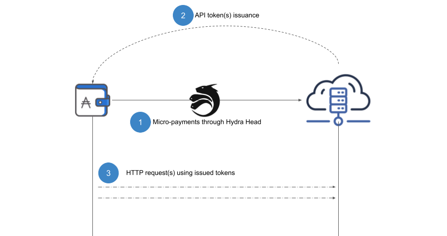

# Pay-per-use API 

> Micro-payments between a service provider and a client.

Let's consider a service of transaction datum resolution in the form of an HTTP API. Given some datum hash, the API can return, if it exists, the pre-image of that hash digest. On the other end, we have a light-wallet provider with full Cardano smart-contract support and extra care for user experience and security. Part of the transaction workflow of the wallet consists of looking up datums and scripts included in transactions it sees, coming from various DApps its users interact with. Doing so, it can better show how a specific transaction will affect a contract and the data it carries. 

To keep the light-wallet infrastructure setup simple, the implementors decide to rely on that external service for datum resolution. However, their relatively new product makes it hard to estimate appropriately the number of resources they would need and how many users they would eventually serve. Thus, they agree with the service provider to create a Hydra Head and use it to issue short-lived API credentials in exchange for a micro-payment. 

Indeed, the service provider demands 10 lovelace per API lookup. In the final infrastructure, the light-wallet backend server is connected to the service provider with a long-running head. On every request from a user, the light wallet also issues a transaction in the Head. In exchange, the API provider gives a one-time token credential which can be used to authorize a request in the API. The whole dance is resolved in sub-second delays and without any transaction fee. 

Regularly, the light-wallet service refuels its Head via incremental commits (i.e. a Layer 1 transaction locking more value inside the Head). Similarly, every now and then, the service provider redeems its funds back to the Layer 1 using incremental de-commits. These two steps happen without ever closing the Head. 

:::tip Rewards
If both parties agree, they can also delegate funds locked inside the Head. This delegation may allow, for instance, the light wallet to keep earning rewards on amounts locked in the Head until the service provider redeems it. Said differently, Head participants can still make a passive income through network rewards to cover the cost of running the Head. 
:::

All-in-all, the light wallet service pay only for what it uses -- in the spirit of _cloud computing_. For the service provider, this is also highly beneficial because they can mutualize their Hydra infrastructure for multiple clients, further spreading their cost and thus, increasing their margin. In addition, they can earn Ada directly and avoid transaction fees on their clients' payments. 

Note also that there are many possible ways this kind of construction can be set up between a client and service provider. For example, one could also imagine API tokens to be fungible tokens, like credits, bought by the client and spent on each request inside the Head. In such a scenario, it would be possible for the server to (a) limit its circulating supply to the number of resources it can handle and (b) create a secondary marketplace for credit surplus that clients have accumulated but won't use.
