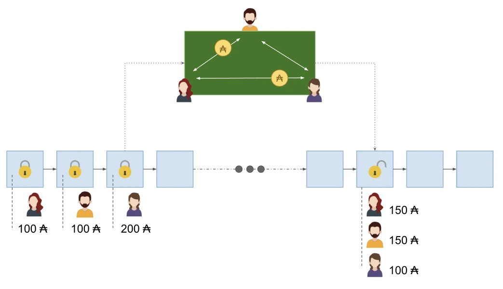

# Poker Game

> A prototypical example of a multi-party state channel.

We love to explain how Hydra heads work using the analogy of a _poker game_ because it suits pretty well the fundamentals behind the Head protocol. A poker game (or any game in general) is a situation with a clear beginning and an end that evolves around a set of agreed-upon rules. In the case of a poker game, the monetary component is at the centre; players place bids and exchange money at every step of the game. 

:::tip Decentralized randomness & Multi-Party Computation
For this use case, we assume that there's a way an agreed-upon way to implement a decentralized poker game with pseudo-randomness or multi-party computation (see, for example [ROYALE by David & al](https://eprint.iacr.org/2018/157)). We focus on the state channel aspect of the story for which Hydra heads provide a solution. 
:::

In a poker game, every player can embody a Hydra Head member, running its own Hydra node. Each participant starts a Head by committing funds to that Head. These represent their chips. Once the Head is established, participants can begin playing the game by leveraging on-head Plutus contracts. Players can instantly process the transfer of funds inside the Head. This is a simple scenario where participants mainly send money to one another, mediated by a script (acting as the game dealer, warrants of the rules and good progress of the game). 

Eventually, the game reaches an end with a well-defined distribution of funds. Participants can then play another game or close the Head and write the end result onto the Layer 1. The whole game(s) is (are) unknown of the Layer 1. Only the final UTxO distribution is. 

Since the game only involves basic payments and script interactions, it could have been played entirely on the Layer 1, without reaching for a Hydra head. However, a Hydra head provides fast-paced transactions for the course of the game and cheap (or even none) fees -- besides the costs needed to establish the Hydra Head.
